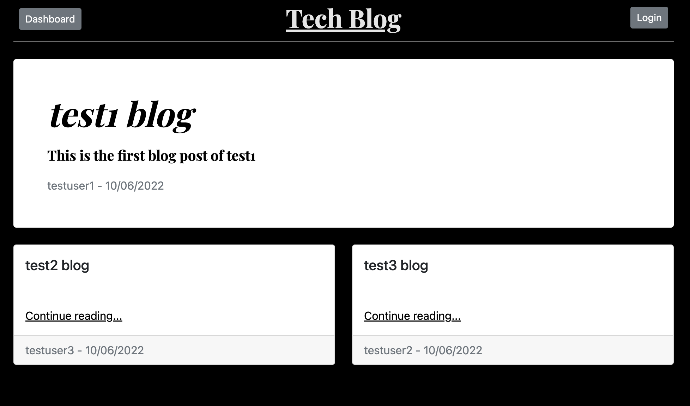
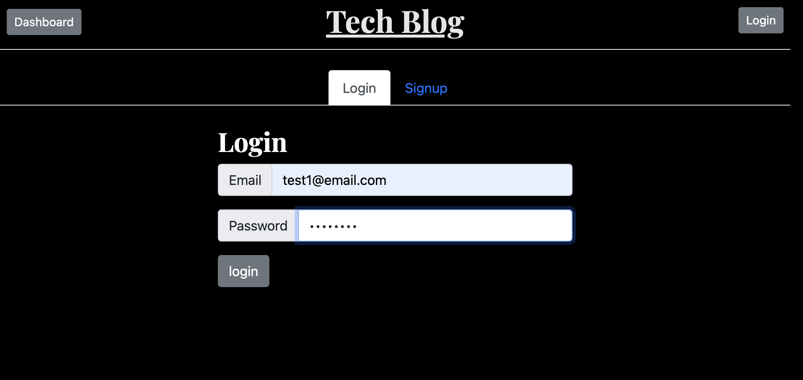
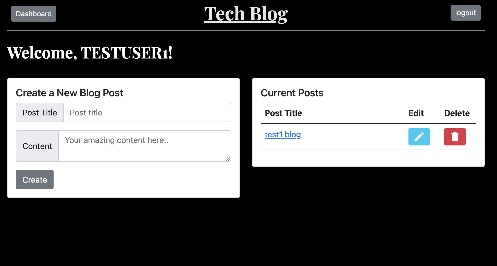

# blog-of-the-future

## Table of Contents
- [Task](#task)
- [Description](#description)
- [Installations](#installations)
- [Run](#run)
- [Website](#website)
- [License](#license)

## Task
The purpose of this task was to build a CMS-style blog site similar to a Wordpress site, where developers can publish their blog posts and comment on other developers’ posts as well. The app follows the MVC paradigm in its architectural structure, using Handlebars.js as the templating language, Sequelize as the ORM, and the express-session npm package for authentication.

## Description 
The app allows a user to create an account and write blogs. You can also edit and delete blogs. On the home page you can view yours as well as other people's blogs. The dashboard needs authentication to be accessed. 

## Installations
npm install

## Run
node server.js

## Screenshots

  
  
Fig 1: home page

   

  
  
Fig 2: login page

   

  
  
Fig 3: dashboard page

## Website
https://secure-springs-93132.herokuapp.com/

https://github.com/gmadnani/blog-of-the-future

## License
[MIT](https://choosealicense.com/licenses/mit/)